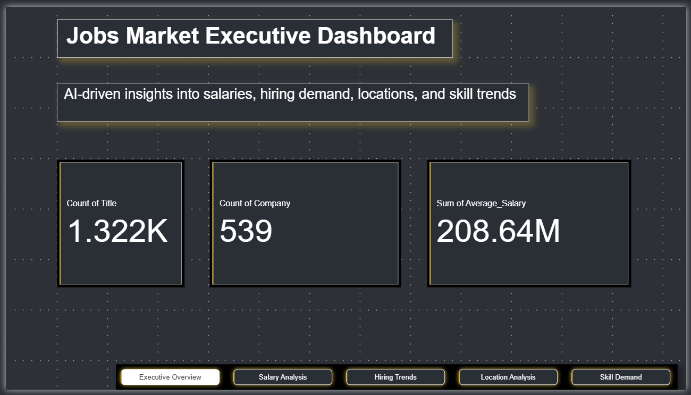
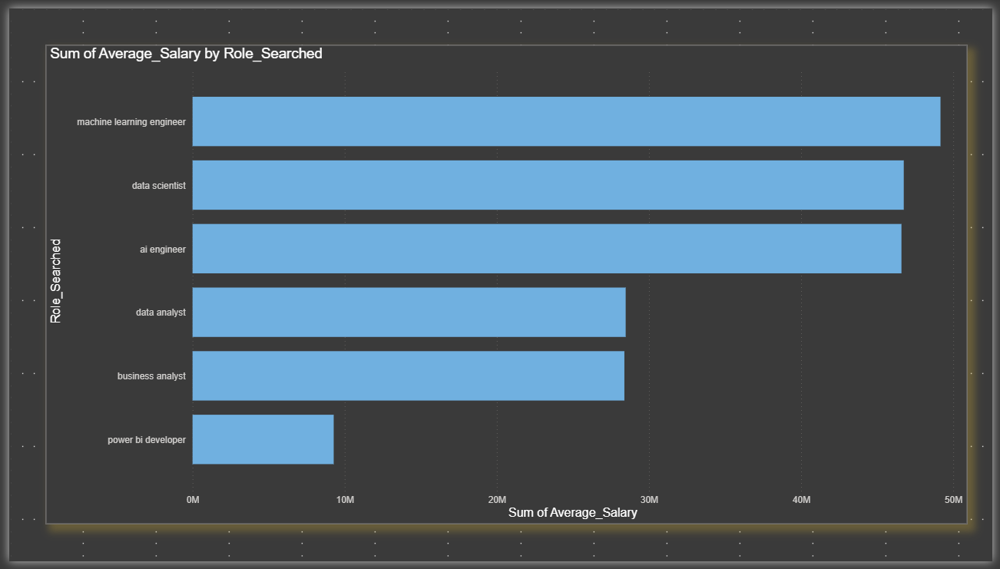
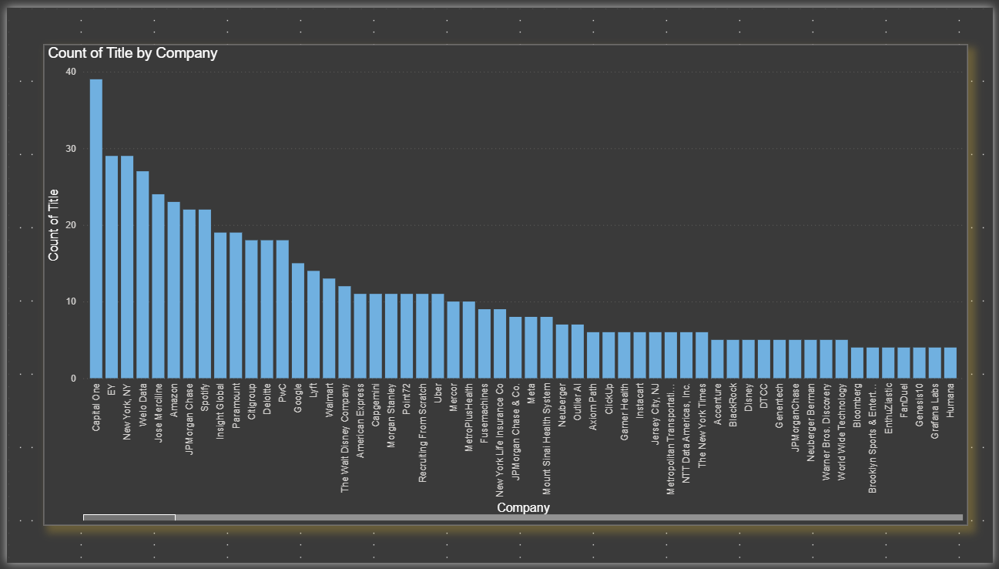

# AI & Data Job Market Intelligence System

## Overview

This project analyzes real-world AI and Data-related job market trends using live job data collected through APIs.

The project focuses on:
- ETL pipeline development
- SQL analytics
- NLP-based skill extraction
- Salary trend analysis
- Hiring trend analysis
- Interactive Power BI dashboards

Unlike static Kaggle datasets, this project uses real-world live job market data to generate business insights and market intelligence.

---

# Tech Stack

- Python
- Pandas
- NumPy
- SQL (SQLite)
- Power BI
- APIs
- Matplotlib
- NLP / Text Processing

---

# Project Workflow

API Data Collection → ETL Pipeline → Data Cleaning → Feature Engineering → EDA → SQL Analytics → NLP Skill Extraction → Power BI Dashboard

---

# Key Features

## Real-World Data Collection
- Collected live AI & Data job postings using APIs
- Extracted multi-role job market data

## ETL Pipeline
- Extracted, transformed, and loaded raw job data
- Structured nested JSON into analytical datasets

## Exploratory Data Analysis (EDA)
- Salary trend analysis
- Company hiring analysis
- Location-based job analysis
- Role demand analysis

## SQL Analytics
- Business SQL queries
- Hiring trend insights
- Salary aggregation analysis
- Company-level analytics

## NLP-Based Skill Extraction
- Extracted high-demand skills from job descriptions
- Identified trends in Python, SQL, Power BI, AI, and ML tools

## Power BI Dashboard
- Interactive business intelligence dashboard
- Salary insights
- Hiring trends
- Skill demand analysis
- Company analytics

---

# Dashboard Preview

## Executive Overview Dashboard



---

## Salary Analysis Dashboard



---

## Skill Demand Dashboard



---

# Key Insights

- Python and SQL were among the most demanded skills
- AI and ML Engineer roles showed higher average salaries
- Hiring demand was concentrated in major tech locations
- Business Analyst and Data Analyst roles showed high job volume

---

# Project Structure

```text
AI-Data-Job-Market-Analysis/
│
├── data/
│   ├── powerbi_jobs_dataset.csv
│   ├── clean_jobs_dataset.xlsx
│   └── skills_analysis.xlsx
│
├── notebooks/
│   └── AI_Data_Job_Market_Analysis.ipynb
│
├── dashboard/
│   └── jobs_dashboard.pbix
│
├── images/
│   ├── dashboard1.png
│   ├── dashboard2.png
│   └── dashboard3.png
│
├── README.md
│
└── requirements.txt
```

---

# How to Run

## Clone Repository

```bash
git clone https://github.com/RedDaredevils/AI-Data-Job-Market-Analysis.git
```

---

## Install Dependencies

```bash
pip install -r requirements.txt
```

---

## Run Notebook

Open Jupyter Notebook or Google Colab and run:

```text
AI_Data_Job_Market_Analysis.ipynb
```

---

# Future Improvements

- Real-time dashboard updates
- Streamlit web app deployment
- Advanced NLP analysis
- Predictive hiring trend forecasting
- Cloud database integration

---

# Author

Adeel Umar
